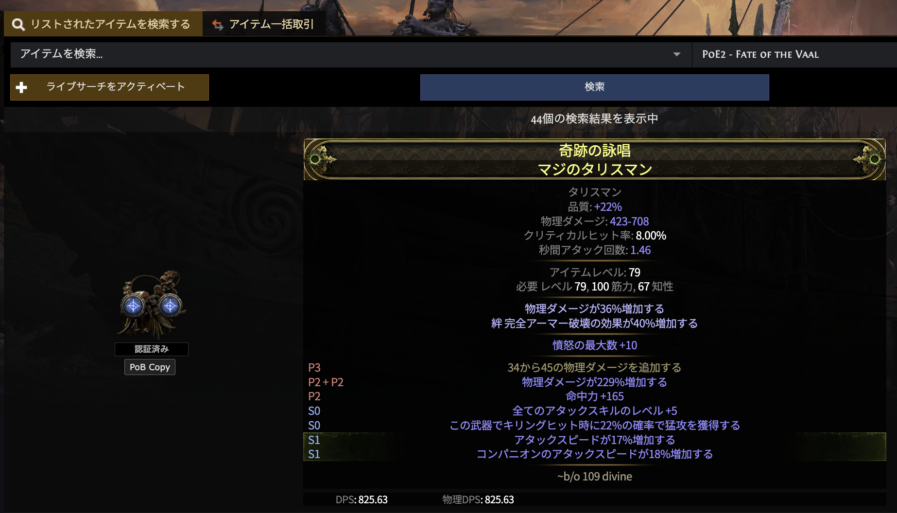

# PoE2 PoB Copy Button

[English](README.md)

## 概述

此扩展在流放之路 2（Path of Exile 2）官方市集页面的每条搜索结果旁添加「PoB Copy」按钮。

点击按钮即可将物品的完整文本格式复制到剪贴板，直接粘贴到 **Path of Building 2** 的「Create Custom」窗口中。

**支持非英文市集站点**（繁体中文、日文等），自动获取英文物品数据确保 PoB 兼容。

## 安装

1. 从 [Releases](https://github.com/WAY29/poe2-pob-copy-button/releases) 下载 `poe2-pob-copy-button-dist.zip`
2. 解压到本地文件夹
3. 打开 Chrome → `chrome://extensions/`
4. 开启右上角「开发者模式」
5. 点击「加载已解压的扩展程序」→ 选择解压后的文件夹

## 使用方法

1. 打开 PoE2 市集搜索页面：`https://www.pathofexile.com/trade2/search/poe2/...`
2. 每条搜索结果左侧会出现「PoB Copy」按钮
3. 点击按钮，物品文本即复制到剪贴板
4. 打开 Path of Building 2 → Items 标签 → 「Create Custom」→ 粘贴（Ctrl+V）

## 截图

## 工作原理

1. 拦截市集页面的 API 请求（`/api/trade2/fetch/`）
2. 若当前处于非英文域名，通过后台脚本向 `pathofexile.com` 重新请求英文版数据
3. 将英文物品数据缓存，按物品 ID 索引
4. 点击按钮时，从缓存中取出英文数据，构建 PoB 兼容的文本格式

## 注意事项

- 非英文站点需要在后台获取英文数据。首次加载搜索结果后，按钮可能在数据缓存完成前短暂显示「Failed」——等待片刻后重试即可
- 此扩展仅与 `pathofexile.com` 域名通信，不会向任何第三方发送数据

## 许可证

MIT License（参见 `LICENSE` 文件）
